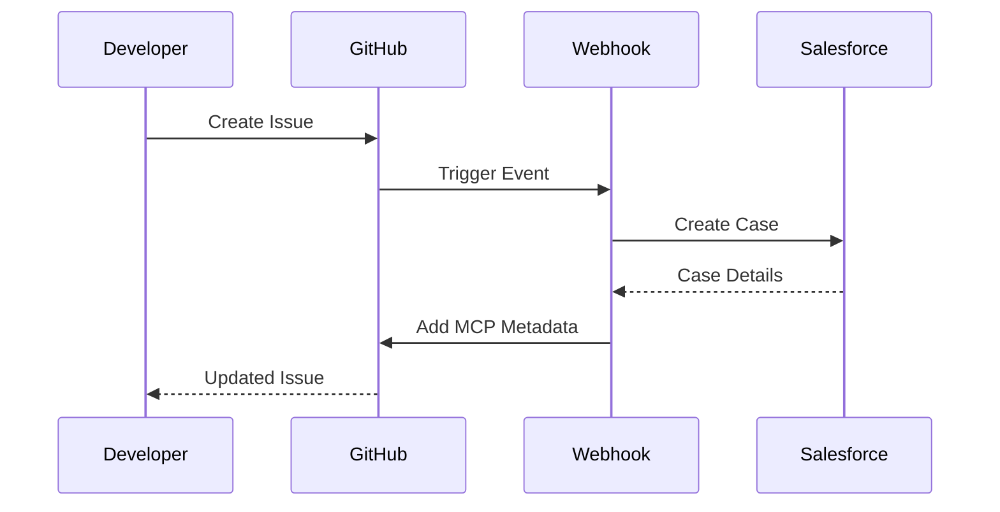

# Salesforce-GitHub Integration with MCP Automation

## 🚀 Overview

This repository implements a **bidirectional synchronization** system between GitHub Issues/Pull Requests and Salesforce Cases using the **Model Context Protocol (MCP)**. The system eliminates manual data entry, maintains clear linkage between systems, and provides audit-ready structured data.

## ✨ Key Features

- **🔄 Bidirectional Sync**: Automatic synchronization between GitHub and Salesforce
- **🏷️ Smart Metadata**: Embedded MCP blocks maintain clear relationships
- **💬 Comment Sync**: Replicate discussions across both platforms  
- **📊 Status Tracking**: Keep issue/case states synchronized
- **🎯 PR Merge Handling**: Configurable case closure on merge
- **🔁 Error Recovery**: Automatic retry with user notifications
- **📝 Audit Trail**: Comprehensive logging of all operations

## 📋 Quick Start

### Prerequisites

- GitHub repository with Actions enabled
- Salesforce org with API access
- Node.js 20+ (for local development)

### Installation

1. **Clone the repository**:
   ```bash
   git clone https://github.com/laneauxc/Salesforce-GitHub-Test.git
   cd Salesforce-GitHub-Test
   ```

2. **Configure GitHub Secrets**:
   
   Go to Settings → Secrets and variables → Actions, add:
   
   ```
   SALESFORCE_INSTANCE_URL=https://yourorg.salesforce.com
   SALESFORCE_USERNAME=integration.user@yourorg.com
   SALESFORCE_PASSWORD=password+securitytoken
   ```

3. **Customize Configuration**:
   
   Edit `/configs/mcp-config.json` to match your needs:
   
   ```json
   {
     "github": {
       "defaultRepo": "your-org/your-repo"
     },
     "triggers": {
       "onCreate": true,
       "onComment": true,
       "onStatusChange": true
     }
   }
   ```

4. **Enable Workflows**:
   
   The workflows are automatically enabled. Verify in Actions tab:
   - ✅ MCP GitHub Webhook Handler
   - ✅ MCP Nightly Sync

### Verification

Create a test issue to verify sync:

```bash
# The webhook will automatically sync to Salesforce
# Check the issue for MCP metadata block
```

## 📚 Documentation

- **[MCP Integration Guide](docs/MCP_INTEGRATION_GUIDE.md)** - Complete usage guide
- **[Configuration Reference](docs/MCP_CONFIGURATION_REFERENCE.md)** - All config options
- **[Architecture](#architecture)** - System design overview

## 🏗️ Architecture

### System Components

```
┌─────────────────────────────────────────────┐
│         MCP Sync Architecture               │
├─────────────────────────────────────────────┤
│                                             │
│  GitHub Issues/PRs  ◄──────► Salesforce    │
│         │                         │         │
│         └────► MCP Orchestrator ◄─┘         │
│                      │                      │
│         ┌────────────┼────────────┐         │
│         │                         │         │
│    Webhook Handler         Nightly Sync     │
│    (Real-time)             (Midnight UTC)   │
│                                             │
└─────────────────────────────────────────────┘
```

### Core Modules

- **`mcp-utils.js`** - Metadata formatting and parsing utilities
- **`github-client.js`** - GitHub API integration layer
- **`salesforce-client.js`** - Salesforce API integration layer
- **`sync-orchestrator.js`** - Main synchronization orchestration logic

### Workflows

- **`mcp-webhook-handler.yml`** - Real-time event processing
- **`mcp-nightly-sync.yml`** - Scheduled batch synchronization

## 🔄 How It Works

### 1. Issue Creation



### 2. MCP Metadata Structure

Every synced issue/PR contains:

```markdown
[SF Case #12345] Fix invoice calculation

<!-- MCP-METADATA -->
```json
{
  "salesforce": {
    "caseId": "5001234567890ABC",
    "caseNumber": "12345",
    "caseStatus": "In Progress"
  },
  "github": {
    "repo": "laneauxc/Salesforce-GitHub-Test",
    "issueNumber": 42,
    "lastSyncedAt": "2026-02-05T06:00:00Z"
  }
}
```
<!-- MCP-METADATA -->
```

### 3. Sync Triggers

| Trigger | Description | Direction |
|---------|-------------|-----------|
| **Creation** | New issue/PR/case created | Bidirectional |
| **Comments** | Comment added | Bidirectional |
| **Status Change** | State/status updated | Bidirectional |
| **PR Merge** | PR merged to main | GitHub → Salesforce |

## 📊 Configuration

### Basic Configuration

Edit `/configs/mcp-config.json`:

```json
{
  "sync": {
    "enabled": true,
    "mode": "bidirectional"
  },
  "triggers": {
    "onCreate": true,
    "onComment": true,
    "onStatusChange": true,
    "onPRMerge": {
      "enabled": true,
      "nightlyCheck": true,
      "immediateClose": false
    }
  }
}
```

### Status Mappings

```json
{
  "salesforce": {
    "statusMapping": {
      "New": "open",
      "In Progress": "open",
      "Closed": "closed"
    }
  }
}
```

See [Configuration Reference](docs/MCP_CONFIGURATION_REFERENCE.md) for all options.

## 🎯 Usage Examples

### Example 1: Sync New Issue to Salesforce

```javascript
// Automatically handled by webhook
// When you create an issue, it's synced to Salesforce
// and updated with MCP metadata
```

### Example 2: Close Case When PR Merges

Configure in `mcp-config.json`:

```json
{
  "triggers": {
    "onPRMerge": {
      "enabled": true,
      "immediateClose": true  // Close case immediately
    }
  }
}
```

### Example 3: Manual Sync Trigger

Trigger nightly sync manually:

1. Go to Actions tab
2. Select "MCP Nightly Sync"
3. Click "Run workflow"

## 🛠️ Development

### Local Setup

```bash
# Install dependencies
npm install @octokit/rest

# Run tests (if configured)
npm test

# Validate configuration
node -e "console.log(JSON.parse(require('fs').readFileSync('./configs/mcp-config.json')))"
```

### Testing

```bash
# Test GitHub client
node src/github-client.js

# Test Salesforce client (mock)
node src/salesforce-client.js

# Test sync orchestrator
node src/sync-orchestrator.js
```

## 🔒 Security

### Best Practices

1. **Never commit credentials** - Use GitHub Secrets
2. **Minimal token scope** - Use read/write repo permissions only
3. **Review data exposure** - Consider public vs private repos
4. **Audit access** - Monitor who has access to secrets
5. **Rotate credentials** - Periodically update Salesforce password

### Required Permissions

#### GitHub Token
- `repo` - Full repository access
- `issues` - Read/write issues
- `pull_requests` - Read/write pull requests

#### Salesforce User
- Read/Write Cases
- Read/Write Case Comments
- API Enabled

## 📈 Monitoring

### Check Sync Status

1. **View Workflow Runs**:
   - Go to Actions tab
   - Check recent "MCP GitHub Webhook Handler" runs

2. **Review Audit Logs**:
   - Check workflow logs for `[MCP-AUDIT]` entries

3. **Monitor Errors**:
   - Filter issues by `sf-sync-error` label
   - Review nightly sync job results

### Metrics

Track these metrics:
- Sync success rate
- Average sync latency
- Error rate by type
- Retry success rate

## 🐛 Troubleshooting

### Common Issues

#### Sync Not Working

1. Check GitHub Actions logs
2. Verify environment variables
3. Test Salesforce credentials
4. Review `mcp-config.json` syntax

#### Duplicate Cases

1. Check for existing MCP metadata
2. Verify case search logic
3. Review webhook event logs

#### Comments Not Syncing

1. Verify `onComment` trigger enabled
2. Check comment author (bot filtering)
3. Review API rate limits

See [Integration Guide](docs/MCP_INTEGRATION_GUIDE.md#troubleshooting) for more.

## 🤝 Contributing

Contributions welcome! Please:

1. Fork the repository
2. Create a feature branch
3. Make your changes
4. Add tests if applicable
5. Submit a pull request

## 📄 License

This project is licensed under the MIT License.

## 📞 Support

- **Issues**: [GitHub Issues](https://github.com/laneauxc/Salesforce-GitHub-Test/issues)
- **Discussions**: [GitHub Discussions](https://github.com/laneauxc/Salesforce-GitHub-Test/discussions)
- **Documentation**: [docs/](docs/)

## 🗺️ Roadmap

- [ ] Enhanced field mapping UI
- [ ] Slack notifications integration
- [ ] Advanced conflict resolution
- [ ] Multi-repository support
- [ ] Dashboard for sync metrics
- [ ] Two-way attachment sync

## 📚 Additional Resources

- [Salesforce REST API](https://developer.salesforce.com/docs/atlas.en-us.api_rest.meta/api_rest/)
- [GitHub REST API](https://docs.github.com/en/rest)
- [GitHub Actions](https://docs.github.com/en/actions)
- [Model Context Protocol](https://modelcontextprotocol.io/)

---

**Version**: 1.0  
**Last Updated**: 2026-02-05  
**Maintained by**: MCP Automation Team
